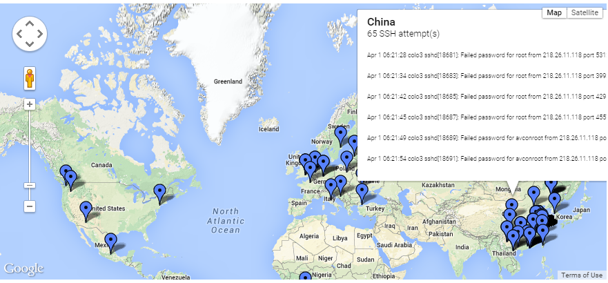

sshfail2kml
===========

v1.3

SSH failed login collector with Google Map KML and JSON output. Scales with SQLite3 and is log-rotator friendly.

<a href="http://www.bryanandrews.org/failedlogins/">DEMO</a>

* Tested with RedHat/CentOS/RHEL, should work on any Debian variant as well
* SQLite3 database for duplicate record prevention and detailed indexed records
* JSON file created and updated each run
* HTML complete with working Google Map KML example
* Mouse hover over action shows number of total recorded login attempts
* Intelligent GeoIP lookups to eliminate redundant queries via external API so no need for local GeoIP dat files
* PHP examples for working with JSON
* Command line switches to overwrite defaults
* Auto detect abuse email addresses for suspect IP addresses and log to SQL and JSON and KML outputs
* SQLite/JSON/KML files saved in /var/lib/sshfail2kml by default
* RPM noarch spec file for RPM creation with examples 
* Debian noarch package in the works
* Externalized settings in optional conf /etc file

Installation
------------

### CentOS/RHEL ###
~~~
wget -O /etc/yum.repos.d/sshfail2kml.repo http://repo.bryanandrews.org/sshfail2kml/centos/sshfail2kml.repo
yum install sshfail2kml
~~~

### Debian ###
~~~
wget -O - http://repo.bryanandrews.org/sshfail2kml/debian/SSHFAIL2KML.gpg.key | apt-key add -
wget -O /etc/apt/sources.list.d/sshfail2kml.list http://repo.bryanandrews.org/sshfail2kml/debian/sources.list
apt-get update
aptitude install sshfail2kml
~~~

Screen Shot
-----------

Usage
-----
~~~
# /usr/bin/sshfail2kml -h
/usr/bin/sshfail2kml [-f] [-j] [-s] [-k] [-m] [-g] [-h] [-q] [-d]

        -f file         Syslog secure or auth.log log file to process.   Default: Auto detect
        -j file         JSON file.                                       Default: /var/lib/sshfail2kml/sshfail2kml.json
        -s file         SQLite3 DB file.                                 Default: /var/lib/sshfail2kml/sshfail2kml.sqlite
        -k file         KML file.                                        Default: /var/lib/sshfail2kml/sshfail2kml.kml
        -m int          Max number of previous hits to show in KML file. Default: 6
        -g url          URL to the GeoIP REST API to use.                Default: http://www.telize.com/geoip/
        -h              This help screen.
        -q              Be quiet.
        -d              Enable debug mode.
~~~

RPM Creation
------------
~~~
[root@colo3 tmp]# curl https://raw.githubusercontent.com/BIAndrews/sshfail2kml/master/contrib/sshfail2kml.spec > sshfail2kml.spec
  % Total    % Received % Xferd  Average Speed   Time    Time     Time  Current
                                 Dload  Upload   Total   Spent    Left  Speed
104  1563  104  1563    0     0   4358      0 --:--:-- --:--:-- --:--:-- 15028
[root@colo3 tmp]# rpmbuild -bb sshfail2kml.spec
Executing(%prep): /bin/sh -e /var/tmp/rpm-tmp.LRG7R0
+ umask 022
+ cd /root/rpmbuild/BUILD
+ LANG=C
+ export LANG
+ unset DISPLAY
+ cd /root/rpmbuild/BUILD
+ rm -rf sshfail2kml-1.3.2
+ /bin/mkdir -p sshfail2kml-1.3.2
+ cd sshfail2kml-1.3.2
+ /bin/chmod -Rf a+rX,u+w,g-w,o-w .
+ exit 0
Executing(%build): /bin/sh -e /var/tmp/rpm-tmp.gTNzLS
+ umask 022
+ cd /root/rpmbuild/BUILD
+ cd sshfail2kml-1.3.2
+ LANG=C
+ export LANG
+ unset DISPLAY
+ /usr/bin/install -d /root/rpmbuild/SOURCES
+ curl -s https://raw.githubusercontent.com/BIAndrews/sshfail2kml/master/sshfail2kml
+ curl -s https://raw.githubusercontent.com/BIAndrews/sshfail2kml/master/sshfail2kml-cron.sh
+ curl -s https://raw.githubusercontent.com/BIAndrews/sshfail2kml/master/sshfail2kml.conf
+ exit 0
Executing(%install): /bin/sh -e /var/tmp/rpm-tmp.XkeJVN
+ umask 022
+ cd /root/rpmbuild/BUILD
+ '[' /root/rpmbuild/BUILDROOT/sshfail2kml-1.3.2-1.x86_64 '!=' / ']'
+ rm -rf /root/rpmbuild/BUILDROOT/sshfail2kml-1.3.2-1.x86_64
++ dirname /root/rpmbuild/BUILDROOT/sshfail2kml-1.3.2-1.x86_64
+ mkdir -p /root/rpmbuild/BUILDROOT
+ mkdir /root/rpmbuild/BUILDROOT/sshfail2kml-1.3.2-1.x86_64
+ cd sshfail2kml-1.3.2
+ LANG=C
+ export LANG
+ unset DISPLAY
+ /bin/mkdir -p /root/rpmbuild/BUILDROOT/sshfail2kml-1.3.2-1.x86_64/etc/cron.d
+ /bin/mkdir -p /root/rpmbuild/BUILDROOT/sshfail2kml-1.3.2-1.x86_64/usr/bin
+ /bin/mkdir -p /root/rpmbuild/BUILDROOT/sshfail2kml-1.3.2-1.x86_64/var/lib/sshfail2kml
+ /usr/bin/install -m0644 /root/rpmbuild/SOURCES/sshfail2kml /root/rpmbuild/BUILDROOT/sshfail2kml-1.3.2-1.x86_64/usr/bin
+ /usr/bin/install -m0644 /root/rpmbuild/SOURCES/sshfail2kml-cron.sh /root/rpmbuild/BUILDROOT/sshfail2kml-1.3.2-1.x86_64/etc/cron.d
+ /usr/bin/install -m0640 /root/rpmbuild/SOURCES/sshfail2kml.conf /root/rpmbuild/BUILDROOT/sshfail2kml-1.3.2-1.x86_64/etc
+ /usr/lib/rpm/find-debuginfo.sh --strict-build-id /root/rpmbuild/BUILD/sshfail2kml-1.3.2
+ /usr/lib/rpm/check-buildroot
+ /usr/lib/rpm/redhat/brp-compress
+ /usr/lib/rpm/redhat/brp-strip-static-archive /usr/bin/strip
+ /usr/lib/rpm/redhat/brp-strip-comment-note /usr/bin/strip /usr/bin/objdump
+ /usr/lib/rpm/brp-python-bytecompile
+ /usr/lib/rpm/redhat/brp-python-hardlink
+ /usr/lib/rpm/redhat/brp-java-repack-jars
Processing files: sshfail2kml-1.3.2-1.noarch
Requires(rpmlib): rpmlib(CompressedFileNames) <= 3.0.4-1 rpmlib(FileDigests) <= 4.6.0-1 rpmlib(PayloadFilesHavePrefix) <= 4.0-1
Checking for unpackaged file(s): /usr/lib/rpm/check-files /root/rpmbuild/BUILDROOT/sshfail2kml-1.3.2-1.x86_64
Wrote: /root/rpmbuild/RPMS/noarch/sshfail2kml-1.3.2-1.noarch.rpm
Executing(%clean): /bin/sh -e /var/tmp/rpm-tmp.XbbvyF
+ umask 022
+ cd /root/rpmbuild/BUILD
+ cd sshfail2kml-1.3.2
+ /bin/rm -rf /root/rpmbuild/BUILDROOT/sshfail2kml-1.3.2-1.x86_64
+ exit 0
[root@colo3 tmp]# rpm -qpil /root/rpmbuild/RPMS/noarch/sshfail2kml-1.3.2-1.noarch.rpm
Name        : sshfail2kml                  Relocations: (not relocatable)
Version     : 1.3.2                             Vendor: (none)
Release     : 1                             Build Date: Tue 07 Apr 2015 05:48:08 PM MST
Install Date: (not installed)               Build Host: colo3.example.org
Group       : Applications/System           Source RPM: sshfail2kml-1.3.2-1.src.rpm
Size        : 15715                            License: GPLv2
Signature   : (none)
Packager    : Bryan Andrews http://www.bryanandrews.org
URL         : https://github.com/BIAndrews/sshfail2kml
Summary     : SSH failed login attempts recorded to Google Maps KML file, JSON, and SQLite3.
Description :
SSH failed login attempts logged and GeoIP info acquired for Google Map KML display in an HTML page. Complete with JSON results and SQLite indexed database for a log rotation friendly setup.
/etc/cron.d/sshfail2kml-cron.sh
/etc/sshfail2kml.conf
/usr/bin/sshfail2kml
/var/lib/sshfail2kml
~~~

SQLite3 Schemas
---------------
~~~
 -- Complete syslog line fail
 CREATE TABLE IF NOT EXISTS previousFails (
  id INTEGER PRIMARY KEY AUTOINCREMENT,
  line STRING UNIQUE NOT NULL,
  ip CHAR(15),
  t TIMESTAMP DEFAULT CURRENT_TIMESTAMP);
 CREATE INDEX IF NOT EXISTS line ON previousFails (line);
 CREATE INDEX IF NOT EXISTS ip ON previousFails (ip);
 CREATE INDEX IF NOT EXISTS t ON previousFails (t);

 -- Indexed table of IP addresses with GeoIP details and hit counts
 CREATE TABLE IF NOT EXISTS ipaddresses (
  id INTEGER PRIMARY KEY AUTOINCREMENT,
  ip CHAR(15) UNIQUE NOT NULL,
  count INT,
  geoip INT,
  latitude REAL,
  longitude REAL,
  country_name CHAR(64),
  city CHAR(64),
  state CHAR(64),
  abuse_email CHAR(128),
  t TIMESTAMP DEFAULT CURRENT_TIMESTAMP);
 CREATE INDEX IF NOT EXISTS ip ON ipaddresses (ip);
 CREATE INDEX IF NOT EXISTS count ON ipaddresses (count);
 CREATE INDEX IF NOT EXISTS country_name ON ipaddresses (country_name);
~~~

JSON Example
------------
~~~
        [218.65.30.73] => Array
        (
            [count] => 45
            [geoip] => 1
            [latitude] => 28.549999237061
            [longitude] => 115.93329620361
            [country_name] => China
            [city] => Nanchang
            [state] => 03
            [abuse_email] => abuse@globenet.com.ph
        )
~~~

> Bryan Andrews 
> bryanandrews@gmail.com 
> http://www.bryanandrews.org 
